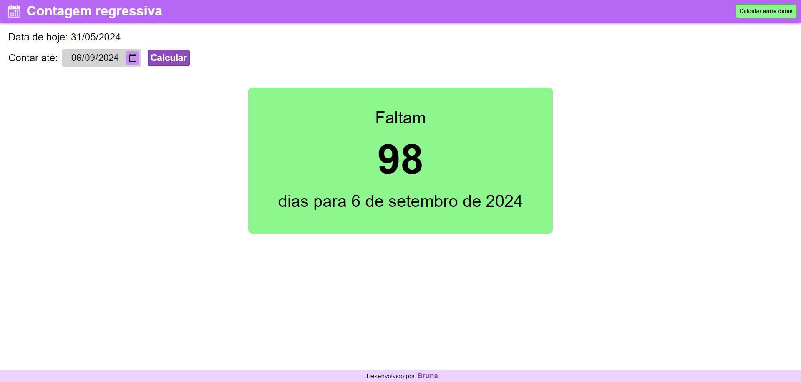
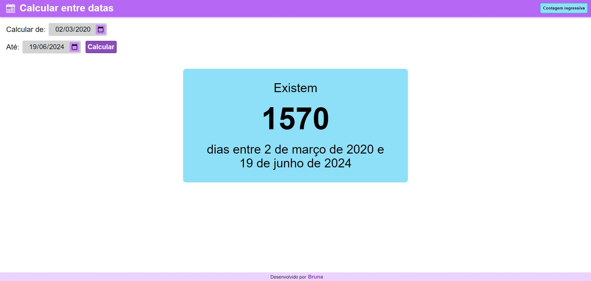

[HTML_BADGE]: https://img.shields.io/badge/html5-%23E34F26.svg?style=for-the-badge&logo=html5&logoColor=white
[CSS_BADGE]: https://img.shields.io/badge/css3-%231572B6.svg?style=for-the-badge&logo=css3&logoColor=white
[JAVASCRIPT_BADGE]: https://img.shields.io/badge/javascript-%23323330.svg?style=for-the-badge&logo=javascript&logoColor=%23F7DF1E
[PROJECT__BADGE]: https://img.shields.io/badge/📱Visit_this_project-000?style=for-the-badge&logo=project
[PROJECT__URL]: https://contagem-dias.vercel.app/

<h1 align="center" style="font-weight: bold;">Contagem de dias 📅</h1>

🌐 <a href="#ingles"> _English README </a> below the portuguese_

![HTML_BADGE]
![CSS_BADGE]
![JAVASCRIPT_BADGE]

  
  

<h2 id="sobre">📖 Sobre</h2>

Projeto de desenvolvimento web: criando uma calculadora que pode fazer contagem regressiva - calculando a distância entre "hoje" e uma data futura ou contagem entre dias de um mesmo ano ou anos diferentes.

[![project][PROJECT__BADGE]][PROJECT__URL]

<h4>📚 Estudo</h4>
Esse projeto serviu de estudo para praticar desenvolvimento web com linguagens HTML, CSS e JavaScript "puros", ou seja, sem utilização de frameworks.

---------------------------------------------------------------------------------------------------------------------------------------

<h1 id="ingles" align="center" style="font-weight: bold;">Date calculator 📅</h1>

![HTML_BADGE]
![CSS_BADGE]
![JAVASCRIPT_BADGE]

  
  

<h2 id="about">📖 About</h2>

Web development project: creating a calculator for countdown - calculating the distance between "today" and a future date or counting between days in the same year or different years.

[![project][PROJECT__BADGE]][PROJECT__URL]

<h4>📚 Study</h4>
This project had the purpose to practice web development with HTML, CSS and JavaScript without any frameworks.
